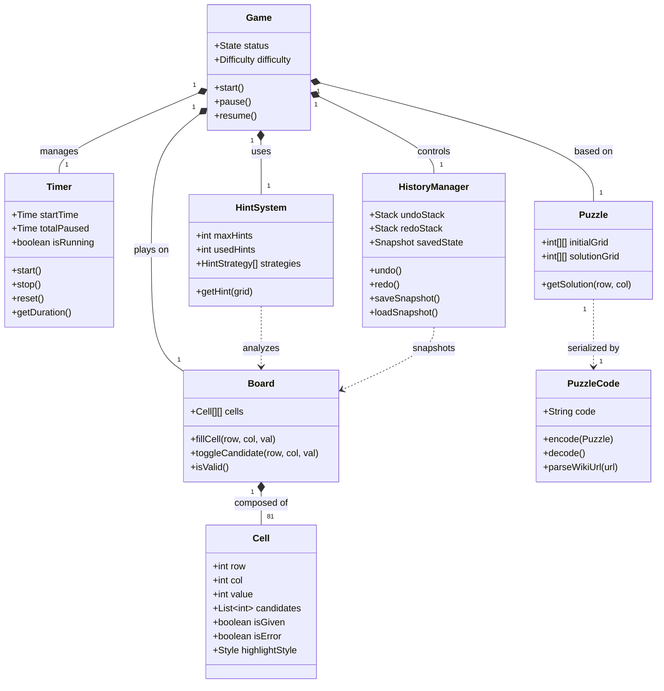
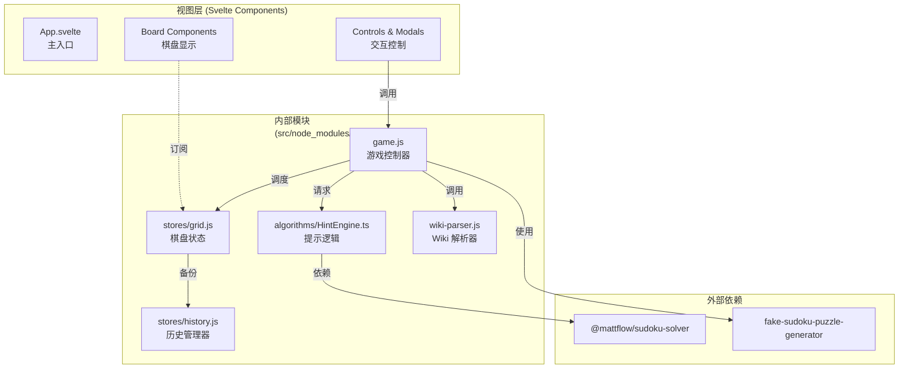
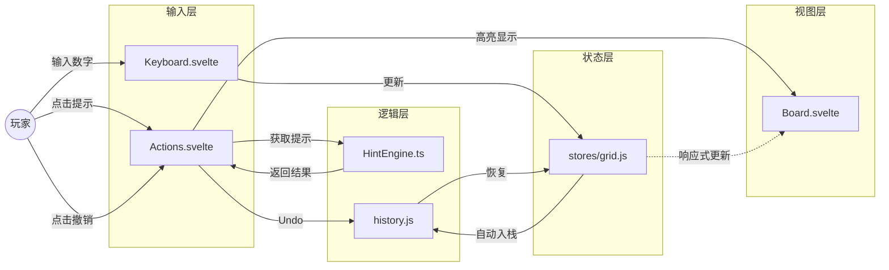

# 面向对象技术 第六组Sudoku LeLe Team Project

## 项目分析与文档

本部分提供了基于 OOAD（面向对象分析与设计）方法的详细逆向工程分析和文档。

### 1. 引言

本报告旨在对 Svelte Sudoku 项目源代码进行全面的逆向工程分析。分析遵循 OOA（分析）、OOD（设计）和 OOP（编程）方法论，深入探讨设计思想、架构模式和实现细节。

该项目是使用 Svelte 框架和 Tailwind CSS 构建的单页应用程序 (SPA)。Svelte 的编译和响应式模型将重点从传统的类层次结构转移到了 **组件组合 (Component Composition)** 和 **响应式状态管理 (Reactive State Management)** 上。

---

### 2. 成员贡献表

| 学号 | 姓名 | 贡献率     | 制品与贡献 |
| :--- | :--- |:--------| :--- |
| **25214418** | **陈永赛** | **20%** | **架构设计与项目管理 (PM)** 1. 需求规格/用例分析/OOAD文档 (100%) 2. Git仓库管理与Code Review (100%) 3. 架构设计与数据结构定义 (100%) |
| **25214529** | **潘畅** | **16%** | **入口适配与新手引导 (Task 1)** 1. SudokuWiki URL 解析器 (`wiki-parser.js`) (100%) 2. 新手引导 Overlay UI 与流程逻辑 (100%) 3. `game.js` 入口适配逻辑改造 (100%) |
| **25214443** | **何松阳** | **16%** | **智能提示算法大脑 (Task 2)** 1. 提示引擎 `HintEngine` 与策略模式实现 (100%) 2. 唯余法 (`NakedSingle`) 与隐性唯一法策略 (100%) 3. 求解器兜底逻辑与 API 对接 (100%) |
| **25214341** | **程彤** | **16%** | **提示交互 UI 表现 (Task 3)** 1. 提示高亮系统 (`Cell.svelte` 呼吸灯动画) (100%) 2. 底部提示文字解释组件 (100%) 3. 操作栏提示按钮逻辑集成 (100%) |
| **25214632** | **周晓林** | **16%** | **时光回溯系统 (Task 4)** 1. 历史栈状态管理 (`history.js`) (100%) 2. 撤销/重做核心逻辑实现 (100%) 3. UI 按钮状态联动与禁用逻辑 (100%) |
| **25214549** | **王剑远** | **16%** | **多分支探索系统 (Task 5)** 1. 快照存取逻辑 (`saveSnapshot`/`loadSnapshot`) (100%) 2. 分支交互 UI 实现（保存/恢复按钮） (100%) 3. 复杂状态下的深拷贝与恢复处理 (100%) |

---

### 3. 面向对象分析 (OOA) - 需求规格

#### 3.1 项目愿景

旨在利用现代 Web 技术，为用户提供简洁、有趣且流畅的在线数独体验。

#### 3.2 用例分析 (Use Case Analysis)

**参与者 (Actor):** 玩家 (Player)

**核心用例:**
1.  **开始新游戏:** 玩家可从欢迎弹窗或下拉菜单选择难度，或通过 **[新增] Wiki 导入** 功能输入 URL 开始特定对局。
2.  **进行游戏:** 玩家操作 `Cell` 填入数字，系统自动校验冲突。
3.  **使用辅助:**
    *   **笔记:** 标记候选数 (Candidates)。
    *   **[新增] 智能提示:** 请求 `HintSystem` 分析当前盘面，提供下一步最优解。
4.  **状态管理:**
    *   **[新增] 撤销/重做:** 利用 `HistoryManager` 回退错误操作。
    *   **[新增] 快照分支:** 保存当前局面作为“存档点”，便于试错探索。
5.  **全局控制:** 暂停/恢复计时器，配置游戏参数。

#### 3.3 领域模型 (Domain Model)

领域模型是对业务世界（Business Domain）中核心概念的抽象。经过深度分析，我们识别出以下完整的领域对象，它们共同构成了数独游戏的核心逻辑：

*   **Game (对局):**
    *   **职责:** 聚合根 (Aggregate Root)。负责协调游戏的整个生命周期（初始化、暂停、恢复、结束、胜利判定）。它是系统对外的统一门面。
    *   **关联:** 包含并管理 `Puzzle`、`Board`、`Timer` 和 `Settings`。
*   **Puzzle (谜题/题目):**
    *   **职责:** 代表游戏的**不可变**初始状态。
    *   **属性:**
        *   `initialGrid`: 题目生成时确定的数字分布（Given Values）。
        *   `solutionGrid`: 预先计算好的完整正确解答，用于终局校验和兜底提示。
    *   **特性:** 它是只读的，在游戏过程中不会改变。
*   **Board (盘面/工作区):**
    *   **职责:** 代表玩家的**可变**工作区域。
    *   **属性:**
        *   `cells`: 9x9 的 `Cell` 对象矩阵。
    *   **行为:** 响应用户的填数 (`fill`)、删除 (`clear`) 和笔记 (`note`) 操作；实时计算行、列、宫的冲突状态 (`invalidCells`)。它初始化时复制自 `Puzzle`。
*   **Cell (单元格):**
    *   **职责:** 盘面上的最小原子单位。
    *   **属性:**
        *   `coordinates`: (x, y) 坐标。
        *   `value`: 当前填入的数字 (1-9 或 0)。
        *   `candidates`: 用户标记的候选数列表 (Set<int>)。
        *   `isGiven`: 是否为题目预设值（不可编辑）。
        *   `isError`: 是否与规则冲突。
        *   **[新增]** `highlightStyle`: 用于提示系统的高亮状态（如提示目标、相关逻辑链）。
*   **Timer (计时器):**
    *   **职责:** 负责维护游戏时长。
    *   **状态:** 不仅仅是一个数字，它维护着内部状态机（运行中、暂停中、停止），并精确计算扣除暂停后的净游戏时长。
*   **Settings (配置):**
    *   **职责:** 定义游戏的规则参数。
    *   **属性:** `highlightConflicts` (是否高亮错误), `limitHints` (限制提示次数), `showTimer` (显示计时器)。
*   **HintSystem (提示系统) [新增]:**
    *   **职责:** 智能辅导模块。
    *   **行为:** `getHint(grid)`。它不依赖预设答案，而是像人类专家一样分析盘面。
    *   **策略:** 内部封装了 `HintStrategy` 接口，支持多种算法（如 `NakedSingle` 唯余法, `HiddenSingle` 隐性唯一法）。
*   **HistoryManager (历史管理器) [新增]:**
    *   **职责:** 提供“后悔药”和“平行宇宙”功能。
    *   **属性:**
        *   `undoStack`: 记录过去的操作步骤。
        *   `redoStack`: 记录被撤销的步骤。
        *   `snapshot`: 内存中的完整状态备份（用于分支探索）。
    *   **行为:** `push()`, `undo()`, `redo()`, `saveSnapshot()`, `loadSnapshot()`。它必须处理对象的深拷贝 (Deep Copy)，以防止引用污染。
*   **PuzzleCode (题目编码):**
    *   **职责:** 序列化与反序列化。
    *   **行为:** 将复杂的 `Puzzle` 对象转换为短字符串 (Sencode) 或解析 Wiki URL，便于分享和存储。

**领域模型类图 (Domain Class Diagram):**

---

### 4. 软件设计规格 (OOD)

#### 4.1 系统技术架构

系统采用基于 Svelte 的 **组件化架构 (Component-Based Architecture)**。

1.  **响应式 (Reactivity):** 这是 Svelte 框架的核心。UI 被设计为状态的函数。当状态（Svelte Stores）发生变化时，所有订阅（使用 $ 语法）该状态的组件都会自动、高效地更新。例如，Board/index.svelte 同时订阅了 $userGrid、$cursor、$settings 等多个 store，当任何一个 store 变化时，相关的 Cell 会自动更新其视图。
2.  **组件化与组合 (Componentization & Composition):** 应用被拆分为一系列独立、可复用的组件。App.svelte 作为根组件，清晰地组合了 Header、Board、Controls 和 Modal 四个顶层组件，构成了页面的宏观布局。
3.  **关注点分离 (Separation of Concerns - SoC):** 这是一个非常出色的设计实践。
    *   **视图 (View):** .svelte 组件（位于 src/components/）严格负责 UI 渲染和捕获用户输入。
    *   **状态与业务逻辑 (State & Logic):** 高度集中在 src/node_modules/@sudoku/ 目录下的 JavaScript 模块中，特别是 stores/ 目录。
    *   这种分离使得组件（如 Keyboard.svelte）只负责“调用”逻辑（如 userGrid.set()），而状态的变更、派生（如 invalidCells 的计算）则全部在 store 模块中处理。

#### 4.2 应用的设计模式

本项目在架构设计中熟练运用了多种经典设计模式：

1.  **观察者模式 (Observer Pattern):** Svelte 的 Store 机制就是典型的观察者模式。UI 组件订阅 Store，当 Store 数据更新时，UI 自动刷新。
2.  **模块单例模式 (Module Singleton):** `game.js`, `timer.js`, `history.js` 等模块导出的是单例对象，确保整个应用共享同一份状态。
3.  **中介者模式 (Mediator Pattern):** `App.svelte` 充当中介者，协调 `Header`, `Board`, `Controls` 等组件的交互，避免组件间直接耦合。
4.  **外观模式 (Facade Pattern):** `game.js` 封装了复杂的子系统接口，对外提供简单的 `start`, `pause` 等方法。
5.  **策略模式 (Strategy Pattern):**
    *   **智能提示:** `HintEngine` 根据盘面难度动态选择 `NakedSingleStrategy` 或 `HiddenSingleStrategy` 等不同策略。
    *   **题目生成:** 内部逻辑支持切换不同的生成算法。
6.  **命令模式 (Command Pattern):** `Keyboard.svelte` 将按键操作封装为命令，统一调用 `userGrid.set` 或 `cursor.move`，解耦了输入设备与逻辑执行。
7.  **备忘录模式 (Memento Pattern):** `history.js` 使用深拷贝（Deep Copy）保存 `userGrid` 的状态快照，实现了撤销/重做和分支存档功能，且不破坏对象的封装性。

---

### 5. 架构评价与改进建议

#### 优点 (Pros)
*   **极清晰的关注点分离 (Excellent SoC):** 视图逻辑 (components/) 与业务逻辑/状态 (stores/) 完全分离。
*   **声明式与响应式:** 自动同步状态，极大减少了手动 DOM 操作带来的 Bug。
*   **高内聚低耦合:** 组件功能单一，通过 Store 通信。

#### 改进建议 (Improvements)
*   **项目结构:** 核心逻辑目前放置在 `src/node_modules/@sudoku/` 下，这是一个反常规的做法（通常用于第三方库）。强烈建议将其迁移到 Svelte 标准的 `src/lib/` 目录下，以符合现代前端工程规范。
*   **依赖倒置 (DIP):** `HintEngine` 和生成器直接依赖具体的算法库。建议引入 `ISudokuSolver` 接口层，使得未来可以轻松替换更高效的求解算法（如 DLX 算法），而无需修改上层逻辑。

---

### 6. 附录：架构图表

#### 6.1 系统架构图 (Current Architecture)

#### 6.2 数据流向图 (Undo/Redo & Hints)

